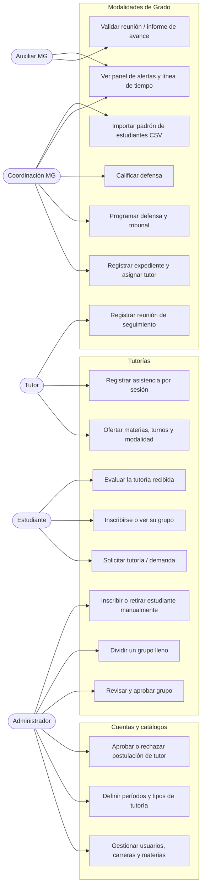
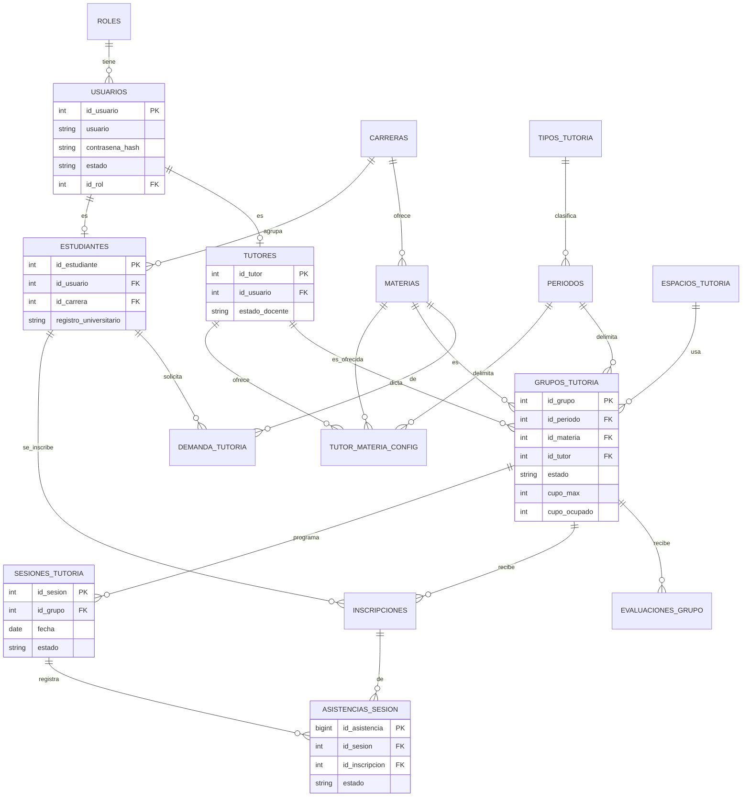
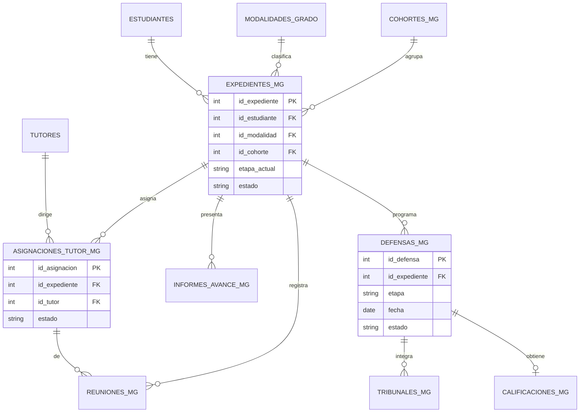
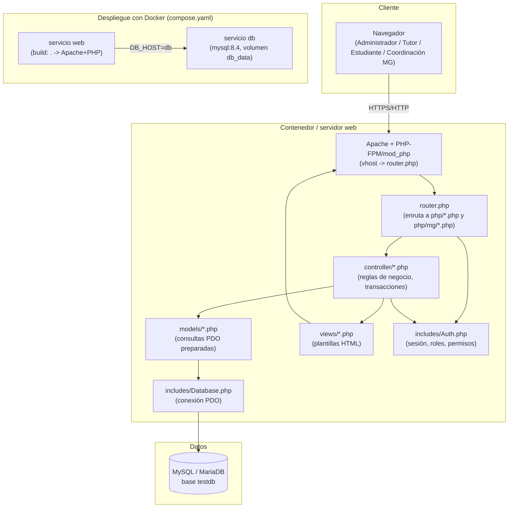

# Diagramas

Diagramas del Sistema web de apoyo académico para tutorías (incluye el módulo
Modalidades de Grado). Se muestran en formato [Mermaid](https://mermaid.js.org/),
que GitHub renderiza automáticamente al ver este archivo en el repositorio.

## 1. Casos de uso

Actores: **Administrador** (gestión general y catálogos), **Tutor** (oferta,
grupos y sesiones), **Estudiante** (solicitud y seguimiento de su tutoría),
**Coordinación MG** (`coordinador_mg`, dueña del módulo de Modalidades de
Grado) y **Auxiliar MG** (`auxiliar_mg`, apoyo con permisos reducidos).

## 2. Modelo entidad-relación

Se separan las entidades del núcleo de **Tutorías** y del módulo
**Modalidades de Grado (MG)**; ambos comparten `usuarios`/`estudiantes`/`tutores`.
No se listan todas las tablas auxiliares (historiales, bitácoras, contadores);
el detalle completo está en `db/init.sql`.

### 2.1 Núcleo: usuarios, catálogos y tutorías

### 2.2 Modalidades de Grado

## 3. Arquitectura

Aplicación PHP nativo (MVC ligero, sin framework) con MySQL/MariaDB, servida
por Apache. El mismo código corre igual en Docker que en un Apache local
(XAMPP): solo cambia el host de base de datos y el puerto.

